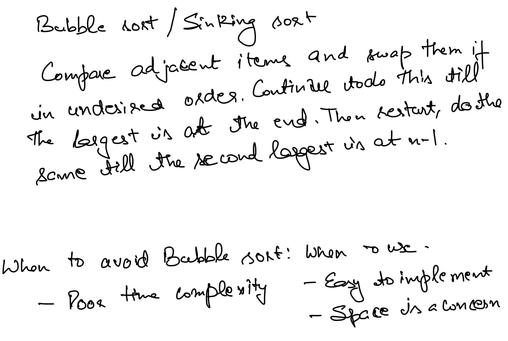
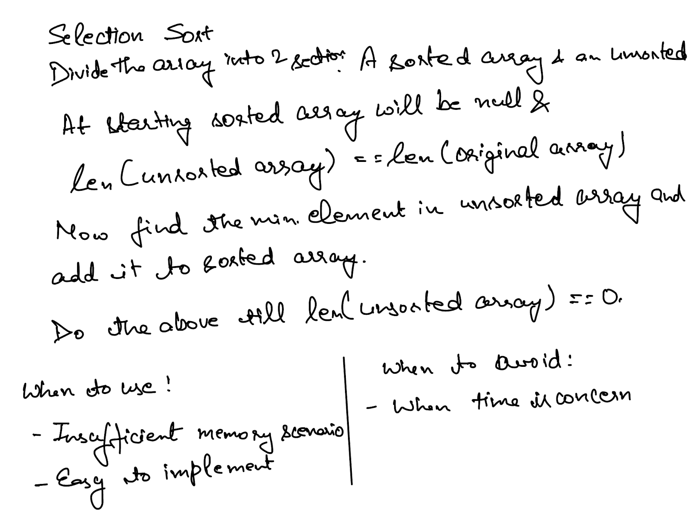
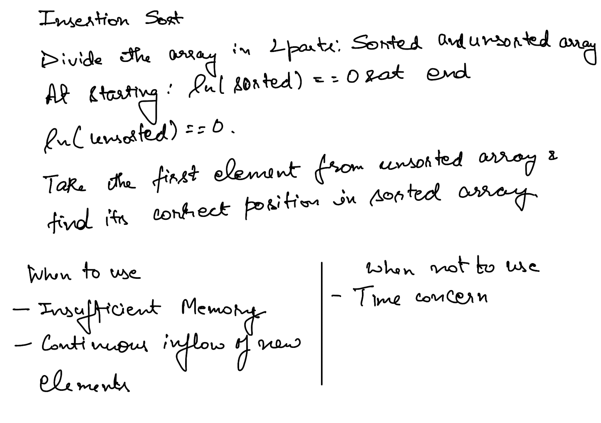
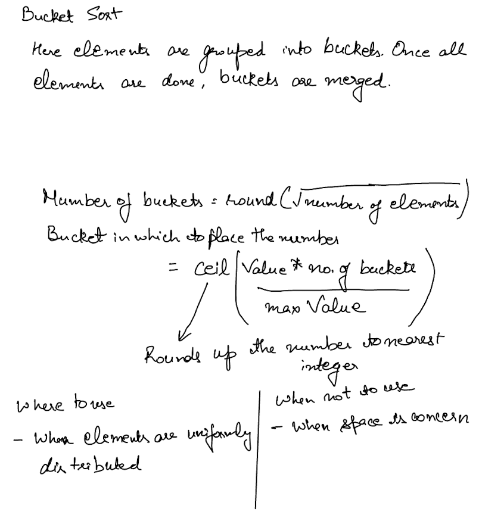
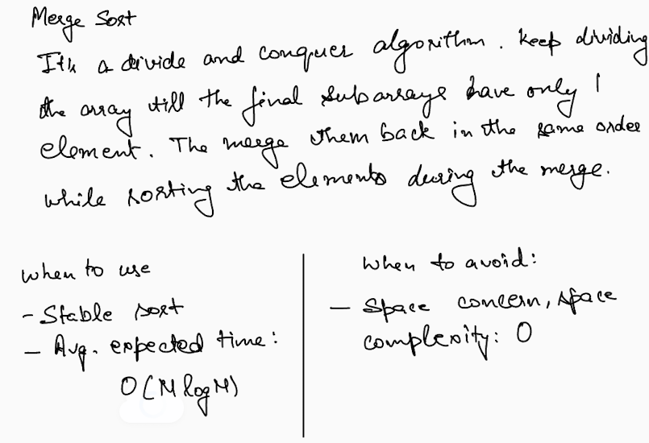

# Sorting Algorithms
Below sorting algorithms can be used based the: stability, space and time efficiency.
* ## Bubble Sort
    
* ## Selection Sort
    
* ## Insertion Sort
    
* ## Bucket Sort
    
* ## Merge Sort
    
* ## Quick Sort

* ## Heap Sort